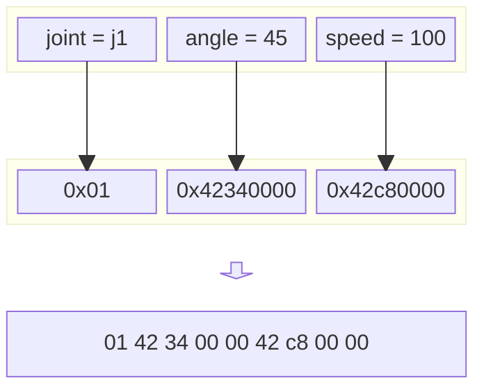
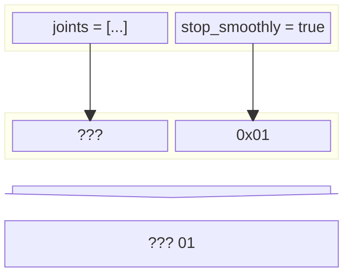
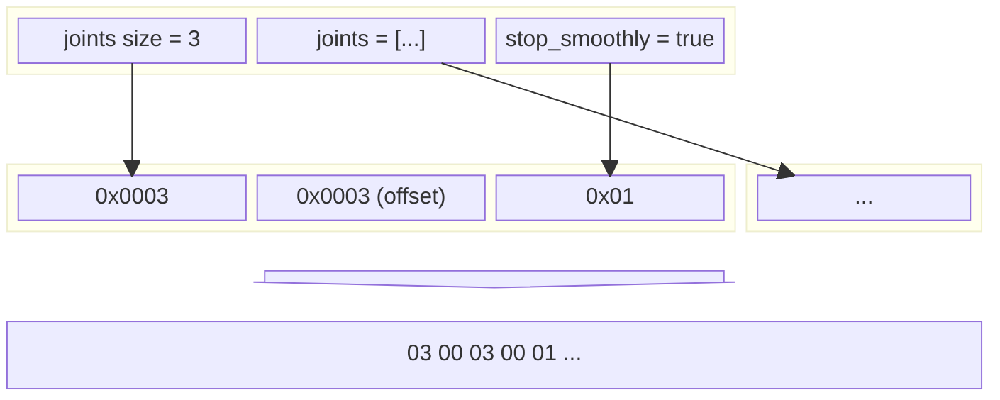
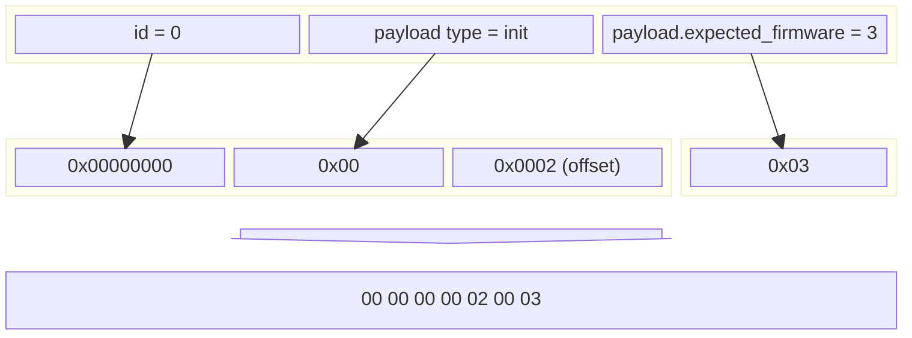
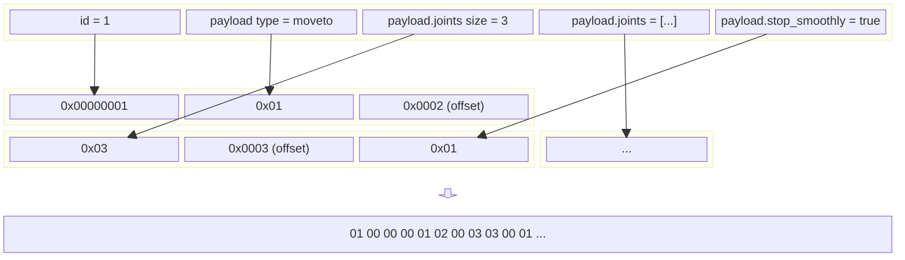

# Serialization Format

SimpleBuffers is designed to encode simple, stable data schemas as efficiently as possible.
Fixed-size data is packed optimally with no padding, labels, or any other metadata. Variable-sized
data structures such as lists and strings require a small amount of additional data (by default, two
bytes). This is explained more below.

Note that data is serialized into little-endian format, as this is natively supported by practically
all modern processors, allowing for efficient decoding in almost all scenarios.

Take the following example schema:

```
enum RobotJoint {
    j0 = 0;
    j1 = 1;
    j2 = 2;
    j3 = 3;
    j4 = 4;
    j5 = 5;
}

sequence Init {
    expected_firmware: u32;
}

sequence MoveToEntry {
    joint: RobotJoint;
    angle: f32;
    speed: f32;
}

sequence MoveTo {
    joints: [MoveToEntry];
    stop_smoothly: bool;
}

sequence Request {
    id: u32;
    payload: oneof {
        init: Init;
        moveTo: MoveTo;
    };
}
```

This schema represents a simple serial protocol that can be used to control a robot arm. Let's go
through it step-by-step.

## Enums

Every element of an enum must be explicitly assigned to a number. When enums are serialized, the
appropriate number is written into the buffer, which can be decoded back into an enum later. Enums
will always use the smallest possible data type that can fully represent them. Most enums, including
`RobotJoint`, are encoded to a single octet.

```
enum BigEnum {
    element_a = 0;
    element_b = 1;
    element_c = 1000;
}
```

The above `BigEnum` will be serialized as a 16-bit value because `element_c` cannot fit within an
octet. Note that this is true even if the value being serialized is `element_a` or `element_b`; the
size of an enum is fixed.

## Fixed-Sized Sequences

Next, let's take a look at our `Init` sequence:

```
sequence Init {
    expected_firmware: u32;
}
```

It only has a single value: `expected_firmware`, which is a 32-bit unsigned integer. Sequences
induce zero overhead. This means that the size of `Init` is exactly equal to the sum of the sizes of
its elements. `Init`, therefore, will always use 32 bits.

`MoveToEntry` also only includes fixed-size elements:

```
sequence MoveToEntry {
    joint: RobotJoint;
    angle: f32;
    speed: f32;
}
```

`angle` and `speed` are both 32-bit floats, and `joint` is an enum. In this case, `RobotJoint` fits
into a single octet, so `MoveToEntry` uses \\(32 + 32 + 8 = 72\\) bits. The actual serialization of
a `MoveEntry` would look like this:



Fixed-size sequences are great. They are not only 100% data-efficient, but they also provide
constant-time access to any element, no matter how deeply nested. This is true because the positions
of all elements are known at compile-time and can be baked into the generated code. However, some
types of data do not have a set size. This data must be encoded differently.

## Lists

Lists consist of a variable number of repeated data. Because we do not know the length of the list
at compile-time, we cannot allocate fixed-size field in a sequence. Take a look at `MoveTo`:

```
sequence MoveTo {
    joints: [MoveToEntry];
    stop_smoothly: bool;
}
```

We know the size of `stop_smoothly`, but `joints` could have any number of elements. This is a
problem because now we cannot know the position of `stop_smoothly` at compile-time; it will change
depending on the length of `joints`.



To solve this, we must find a way to force `joints` to be a fixed size. Fortunately, a solution
already exists: pointers. Instead of storing the full list in `joints`, we can instead store a
fixed-size pointer and place the list at the end of the buffer where it can no longer hurt us. In
practice, we prefer to store a relative offset rather than an absolute pointer, as this allows
complex sequences to be decomposed more effectively.

We must also encode the size of the list. This is done in the fixed-sized segment, which allows
access without indirection. Both the offset and the list size are stored as unsigned 16-bit
integers.



## Strings

Unlike lists, strings must be null-terminated. This means that we do not have to store the size of
the string. Otherwise, they are identical.

## Oneofs

There are two possible ways to implement the oneof: as a fixed-sized union or a dynamically-sized
pointer. The main drawback of a union is the space requirements. Like an enum, a union must always
be as large as the largest possible member. Unlike an enum, however, union members are expected to
sometimes be vastly different sizes. This leads to increased storage inefficiency in all but the
best case. For this reason, SimpleBuffers instead implements the oneof as a dynamically-sized
structure.

Like a list, the oneof stores two values in the fixed-size segment of the buffer: the type of data
being stored, and an offset to the data. The data type is stored as a single octet. Oneofs with more
than 255 members are unsupported.

Let's take a look at how a `Request` with an `Init` payload would be serialized:

```
sequence Request {
    id: u32;            // <-- 0
    payload: oneof {
        init: Init;     // <-- .expected_firmware = 3
        moveTo: MoveTo;
    };
}
```



Now, we look at the other oneof case: a `MoveTo` payload. At first, this appears slightly more
complicated, as `MoveTo` requires its own dynamic sizing. In practice, however, it is fairly simple.

When serializing data, a cursor is placed in the destination buffer at the end of the fixed-sized
data. Every piece of dynamic data is placed at the cursor position, and the cursor is incremented to
the end of the new data.

```
sequence Request {
    id: u32;            // <-- 1
    payload: oneof {
        init: Init;
        moveTo: MoveTo; // <-- .joints size = 3, .stop_smoothly = true, .joints = ...
    };
}
```


